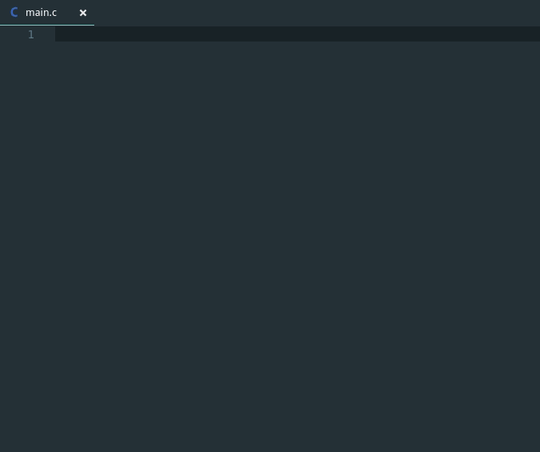

# epitech-styling-code

Code and check your Epitech styling code.

## Features Checked

- [x] Tabs/spaces at end of line.

- [x] Mix tabs/spaces.

- [x] Comment inside function.

- [x] Function > 20 lines.

- [x] Line > 80 columns.

- [x] More than 4 parameters.

- [x] Bad header.

## Installation

- In vscode press **CTRL+P**.
- Then Copy/Paste :
`ext install lucasmarandat.epitech-styling-code`

## Want new feature ?

Write an issue on [github repository](https://github.com/lucasmrdt/epitech-styling-code)

**Enjoy!**